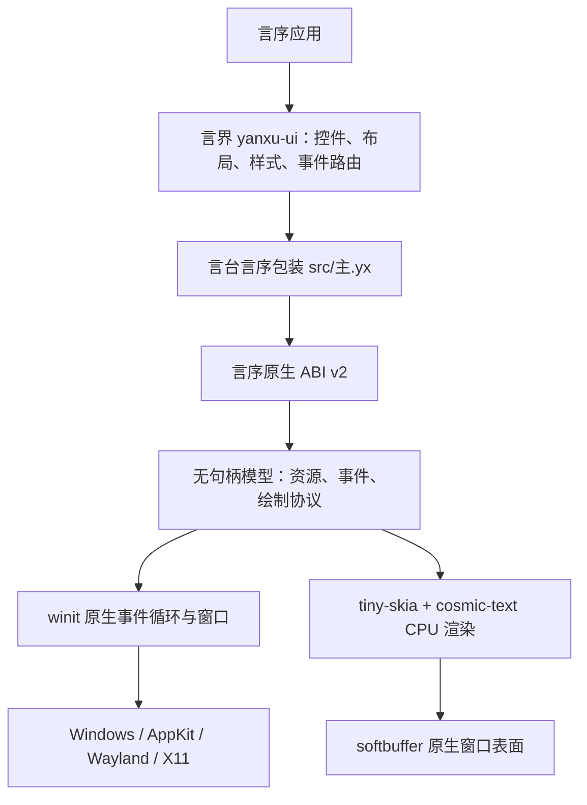

# 言台架构

本文描述 `yanxu-platform 0.1.0` 已实现的架构。言台只提供桌面平台原语；按钮、输入框、
布局、焦点树和主题继承属于上层 `yanxu-ui`，现有 `yanxu-gui` 则继续保持独立 API。

## 分层

公开边界只有言序值、回调和带类型的原生资源。系统窗口句柄、原始指针、Win32、AppKit、
Wayland 与 X11 对象不会越过该边界。

## 组件

| 路径 | 职责 |
| --- | --- |
| `src/主.yx` | 言序 1.1.7 公共包装；把原生资源封装为应用、窗口、计时器、图片和字体 |
| `native/src/abi.rs`、`bridge.rs` | ABI v2 布局与递归值编解码；拒绝空指针、非有限数和错误类型 |
| `native/src/backend.rs` | 34 个原生操作、权限检查、参数校验与稳定错误代码 |
| `native/src/model.rs` | 不含系统句柄的父子资源图和窗口状态 |
| `native/src/event.rs` | 事件协议 v1.1、有界批次与高频事件合并 |
| `native/src/protocol.rs`、`draw.rs` | 绘制协议 v1.1 与结构化命令的一次性编译 |
| `native/src/render.rs` | 统一 CPU 栅格化和字形重放 |
| `native/src/text.rs` | 系统/自定义字体、复杂整形、测量、索引映射与命中测试 |
| `native/src/windowing.rs` | `winit` 多窗口事件循环、系统事件归一化和 `softbuffer` 呈现 |

## 两条主数据流

事件方向：操作系统事件先在事件循环线程转换为平台事件，写入容量为 4096 的队列；连续
指针移动、尺寸变化与重绘只保留最新值，连续滚轮增量相加。随后整批通过一个 ABI 回调
交给言序。离散事件是合并屏障，顺序不会被跨越。

绘制方向：言序把整帧结构化命令交给`绘制编码`，原生侧一次编译为 `YXDR` 二进制帧；
窗口只保存最后提交的完整帧。重绘时，渲染器按逻辑像素和当前 DPI 比例生成整张 CPU
像素图，再一次呈现到原生表面。绘制期间不会逐命令跨越 ABI。

## 状态与所有权

每个应用拥有一个独立模型和文字服务。应用是唯一根资源，窗口、计时器、图片和字体都
是其直接子资源。关闭父资源时先清理子资源、最后清理父资源；ABI 包装的析构再次发生
时是幂等的。应用回调在创建时保留，在应用资源最终清理时释放。

模型以 `Arc<Mutex<_>>` 共享，但系统窗口、表面与渲染器只存在于事件循环的 `Runner`
中。资源还记录 ABI v2 的事件循环编号与所有者线程令牌，跨宿主或跨线程误用会返回
`PLATFORM_WRONG_THREAD`。

## 后端策略

0.1.0 使用一个 Rust 公共后端，由 `winit` 在编译目标上选择 Windows、macOS、Wayland
或 X11 集成。Linux 同时启用 Wayland 和可动态加载的 X11/Wayland 路径；运行时由窗口
库按桌面会话选择。平台差异被收敛在依赖和 `windowing.rs`，上层言序代码没有条件分支。

| 目标 | CI 执行器 | 窗口后端 |
| --- | --- | --- |
| `x86_64-pc-windows-msvc` | `windows-2025` | Windows |
| `aarch64-pc-windows-msvc` | `windows-11-arm` | Windows |
| `x86_64-apple-darwin` | `macos-15-intel` | AppKit |
| `aarch64-apple-darwin` | `macos-15` | AppKit |
| `x86_64-unknown-linux-gnu` | `ubuntu-24.04` | Wayland / X11 |
| `aarch64-unknown-linux-gnu` | `ubuntu-24.04-arm` | Wayland / X11 |

每个矩阵项执行格式、测试、Clippy、Release 构建、ABI 导出检查、言序 1.1.7 集成和制品
摘要校验；Linux 额外在 Xvfb 中运行真实窗口冒烟。

## 稳定不变量

- 平台、事件、绘制协议分别版本化；不兼容变化提升主版本。
- 所有多字节绘制字段为小端序，命令带长度且填充必须为零。
- 所有公开坐标与尺寸使用逻辑像素；物理尺寸只作为事件附加字段返回。
- ABI 输入不接受 NaN 或无穷大；文字、图片、队列和绘制缓冲都有硬上限。
- 未知事件字段由消费者忽略；绘制同主版本的未知操作码由旧后端按长度跳过。
- 高级控件不进入言台；同一言序上层代码在六个目标使用相同接口。

## 非目标

0.1.0 不提供 GPU 合成、浏览器/WebView、原生控件包装、辅助功能树、打印、系统托盘或
移动平台。透明“图层”当前是可由保存/恢复包围的透明度状态，不是隔离的离屏合成组。
这些限制不会通过虚构能力字段隐藏。
