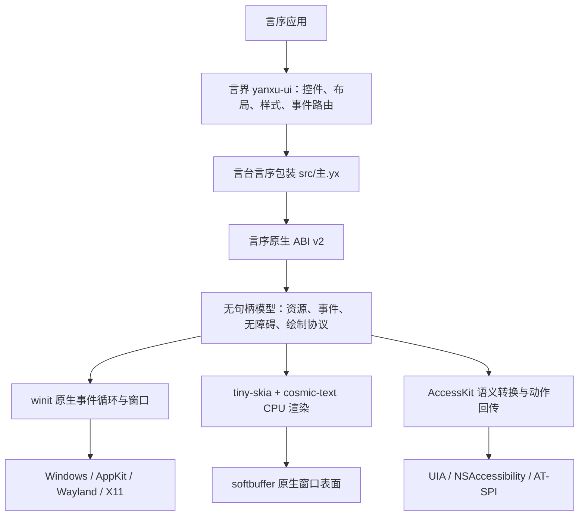

# 言台架构

本文描述 `yanxu-platform 0.8.0` 已实现的架构。言台只提供桌面平台原语；按钮、输入框、
布局、焦点树和主题继承属于上层 `yanxu-ui`，现有 `yanxu-gui` 则继续保持独立 API。

## 分层

公开边界只有言序值、回调和带类型的原生资源。系统窗口句柄、原始指针、Win32、AppKit、
Wayland 与 X11 对象不会越过该边界。

## 组件

| 路径 | 职责 |
| --- | --- |
| `src/主.yx` | 言序 1.1.7 公共包装；把原生资源封装为应用、窗口、计时器、图片和字体 |
| `native/src/abi.rs`、`bridge.rs` | ABI v2 布局与递归值编解码；拒绝空指针、非有限数和错误类型 |
| `native/src/backend.rs` | 41 个原生操作、权限检查、参数校验与稳定错误代码 |
| `native/src/model.rs` | 不含系统句柄的父子资源图、应用配额/生命周期、窗口状态与指标 |
| `native/src/event.rs` | 事件协议 v1.3、有界批次、高频事件合并与队列水位 |
| `native/src/accessibility.rs` | 无障碍协议 v1.0、有界语义树及角色、状态、动作校验 |
| `native/src/native_accessibility.rs` | 稳定原生树、Unicode 文字运行、平台动作转换与激活快照 |
| `native/src/protocol.rs`、`draw.rs` | 绘制协议 v1.1 与结构化命令的一次性编译 |
| `native/src/render.rs` | 统一 CPU 栅格化和字形重放 |
| `native/src/sync.rs` | 中毒锁恢复与进程级恢复计数 |
| `native/src/text.rs` | 系统/自定义字体、复杂整形、测量、索引映射与命中测试 |
| `native/src/windowing.rs` | `winit` 多窗口事件循环、系统事件归一化和 `softbuffer` 呈现 |

## 两条主数据流

事件方向：操作系统事件先在事件循环线程转换为平台事件，写入容量为 4096 的队列；连续
指针移动、尺寸变化与重绘只保留最新值，连续滚轮增量相加。随后整批通过一个 ABI 回调
交给言序。离散事件是合并屏障，顺序不会被跨越。

绘制方向：言序把整帧结构化命令交给`绘制编码`，原生侧一次编译为 `YXDR` 二进制帧；
窗口只保存最后提交的完整帧，并以单槽待呈现状态替换尚未显示的旧帧。重绘时，渲染器按
逻辑像素和当前 DPI 比例生成整张 CPU 像素图，再一次呈现到原生表面；帧序号防止旧帧
完成时清除新帧状态。成功交给表面后排入带单调时间的`帧呈现`事件，供上层驱动下一帧。
绘制期间不会逐命令跨越 ABI。

## 状态与所有权

每个应用拥有一个独立模型和文字服务。应用是唯一根资源，窗口、计时器、图片和字体都
是其直接子资源。关闭父资源时先清理子资源、最后清理父资源；ABI 包装的析构再次发生
时是幂等的。应用回调在创建时保留，在应用资源最终清理时释放。

模型在首个子资源或首次运行前允许下调应用配额，之后永久冻结。资源创建、帧替换和
无障碍更新使用检查运算先计算下一总量；窗口初始事件批量提交，字体和图片在修改外部
服务前预检。应用生命周期按就绪、运行、退出请求、已退出和已关闭单向迁移，事件循环
守卫把所有返回路径收敛到确定状态。

模型以 `Arc<Mutex<_>>` 共享，但系统窗口、表面与渲染器只存在于事件循环的 `Runner`
中。资源还记录 ABI v2 的事件循环编号与所有者线程令牌，跨宿主或跨线程误用会返回
`PLATFORM_WRONG_THREAD`。

FFI 已捕获的恐慌可能让标准互斥锁进入中毒状态。0.8.0 在下一次访问时保留内存安全状态、
清除中毒标记并累计恢复次数，使资源析构和事件循环不会因同一故障再次恐慌。该计数通过
调试快照公开，应用可把非零值纳入故障遥测。

## 可观测性与背压

模型累计资源创建/关闭、实时数量和高水位；事件批处理器累计接收、合并、拒绝、批次、
排出数量与队列高水位；帧路径累计提交、替换、渲染、呈现、失败、待呈现数量和字节高
水位；无障碍模型累计当前树、节点、文字字节及高水位，并区分树更新、重复快照、清除、
焦点/动作请求和拒绝；原生桥另计当前激活、高水位、激活/停用、树同步、请求与拒绝；
配额另计上限/配置/冻结和各资源类别拒绝，应用生命周期另计运行、退出、失败、关闭、
回收资源与归零。
累计计数使用饱和加法，窗口关闭会扣除当前量但保留高水位和累计量；诊断读取不会清零
或改变运行状态。

背压发生在两个明确边界：离散事件超过 4096 时返回稳定错误并停止循环，避免静默丢失；
帧提交则按窗口使用容量为 1 的最新值槽，允许丢弃尚未呈现的中间视觉状态，同时保留
替换计数和被替换帧序号供上层判断生产速度是否持续超过呈现速度。帧序号限定在言序可
精确表达的正整数范围内，耗尽时返回稳定错误而不回绕。

剪贴板方向：言序文字或 RGBA8 图片先经过权限、格式、尺寸、检查乘法和总字节数验证，
再交给 `arboard`；从操作系统读取的数据在编码回 ABI 前经过同一容量验证。后端不会把
平台私有图片对象或未经约束的 MIME 数据暴露给上层。

## 后端策略

0.8.0 使用一个 Rust 公共后端，由 `winit` 在编译目标上选择 Windows、macOS、Wayland
或 X11 集成，由 AccessKit 选择 UIA、NSAccessibility 或 AT-SPI。Linux 同时启用 Wayland
和可动态加载的 X11/Wayland 路径；运行时由窗口库按桌面会话选择。平台差异被收敛在依赖、
`windowing.rs`和`native_accessibility.rs`，上层言序代码没有条件分支。

| 目标 | CI 执行器 | 窗口后端 | 无障碍后端 |
| --- | --- | --- | --- |
| `x86_64-pc-windows-msvc` | `windows-2025` | Windows | UIA |
| `aarch64-pc-windows-msvc` | `windows-11-arm` | Windows | UIA |
| `x86_64-apple-darwin` | `macos-15-intel` | AppKit | NSAccessibility |
| `aarch64-apple-darwin` | `macos-15` | AppKit | NSAccessibility |
| `x86_64-unknown-linux-gnu` | `ubuntu-24.04` | Wayland / X11 | AT-SPI |
| `aarch64-unknown-linux-gnu` | `ubuntu-24.04-arm` | Wayland / X11 | AT-SPI |

每个矩阵项执行格式、测试、Clippy、Release 构建、ABI 导出检查、言序 1.1.7 集成和制品
摘要校验；六个目标都运行提交语义树的真实窗口自动退出冒烟，Linux 使用 Xvfb。

## 稳定不变量

- 平台、事件、绘制协议分别版本化；不兼容变化提升主版本。
- 所有多字节绘制字段为小端序，命令带长度且填充必须为零。
- 所有公开坐标与尺寸使用逻辑像素；物理尺寸只作为事件附加字段返回。
- ABI 输入不接受 NaN 或无穷大；文字、图片、队列和绘制缓冲都有硬上限。
- 未知事件字段由消费者忽略；绘制同主版本的未知操作码由旧后端按长度跳过。
- 高级控件不进入言台；同一言序上层代码在六个目标使用相同接口。

## 非目标

当前不提供 GPU 合成、浏览器/WebView、原生控件包装、打印、系统托盘或移动平台。透明
“图层”当前是可由保存/恢复包围的透明度状态，不是隔离的离屏合成组。原生无障碍桥只
承诺桌面六目标；密码文字选区不向辅助技术暴露。这些限制不会通过虚构能力字段隐藏。
