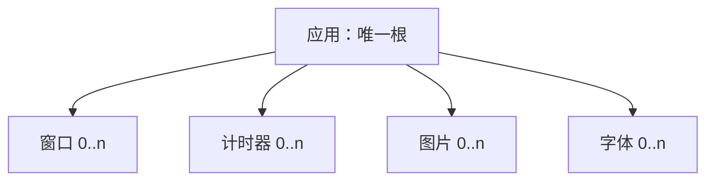

# 资源生命周期

言台使用言序 ABI v2 的带类型原生资源，不把整数或指针伪装成对象。资源句柄由宿主管理，
原生包装与无句柄模型共同保证所有权和幂等清理。

## 所有权图

不允许窗口拥有窗口或其他资源，也不允许无父资源创建窗口、计时器、图片或字体。模型为
每个节点记录单调编号、父节点、子节点集合和具体状态。

## 创建

应用创建时：

1. 校验 ABI v2 主机结构和`图形界面`权限；
2. 保留事件回调；
3. 创建独立模型与文字服务；
4. 创建根节点并排队`应用启动`；
5. 把原生资源及其析构函数交给宿主。

子资源的 ABI 描述符同时携带父应用句柄。宿主因而会保持父资源可达；模型再次校验父子
类型，避免只依赖宿主 GC 顺序。

窗口创建把资源图修改与`窗口显示`/`需要重绘`初始事件作为一个事务。事件批次任一项
失败时，队列保持原状，资源编号、父子关系、使用量、配额冻结和资源指标全部恢复。字体
加载先以待创建节点预检数量和字节，再修改文字服务；图片加载先预检资源槽，并把解码器
预算限制为应用剩余图片字节。

## 应用配额

默认硬上限为 4096 个资源、64 个窗口、2048 个计时器、256 张图片、64 个字体、256 MiB
图片字节、128 MiB 字体字节、128 MiB 保留帧、65536 个无障碍节点和 16 MiB 无障碍文字。
应用可以在首个子节点或首次运行前下调任意字段；之后永久冻结。创建、帧替换和无障碍树
更新先计算新的应用总量，任一字段超限就保留旧状态并返回对应稳定错误。

关闭图片、字体、窗口或整个应用会从当前使用量扣除它实际拥有的字节、帧和无障碍树，
但累计拒绝、高水位和生命周期统计保留到模型销毁。配额是并发持有量边界，不是累计创建
次数限制。

## 显式关闭与析构

所有包装都有`关闭（）`。第一次关闭用原子标志取得清理权，并从模型中递归移除节点；
子节点先于父节点。后续显式关闭或宿主析构立即返回，不会重复释放回调或系统资源。

关闭应用会使所有子节点在模型中失效。若言序代码仍保存某个子句柄，下一次操作返回
`PLATFORM_RESOURCE_CLOSED`；该 ABI 包装稍后析构也是安全的。关闭窗口时，事件循环在
下一次模型同步销毁实际窗口表面并产生`关闭完成`。

应用状态从就绪进入运行或退出请求，事件循环返回后进入已退出；关闭根资源后为已关闭。
重复退出和重复运行完成不会重复修改状态或计数；已退出应用拒绝再次运行。正常返回和
致命后端错误分别累计，错误代码保留在关闭前可读取的调试快照中。

## 回调

应用事件回调在应用创建时由宿主`retain`一次，在应用包装清理时`release`一次。运行事件
循环期间再临时保留一次，`运行`返回后释放，防止回调在阻塞循环中被回收。投递失败或
panic 隔离都不会跳过最终资源析构。

## 帧中的资源引用

图片命令保存 ABI 资源句柄，不复制图片到二进制帧。呈现时通过 ABI v2 `resource_get`
解析句柄，并再次校验资源类型、事件循环身份和模型状态；无效或已关闭图片不会越界读取。
像素存储仍由图片资源拥有。

加载字体的字节由字体模型节点拥有。渲染器第一次看到该节点时复制字节进入自身字体库，
并记录已同步的模型编号。关闭字体阻止新的模型读取，但本应用已建立的文字/字形缓存直到
事件循环结束才释放，这与常见字体库的不可卸载缓存语义一致。

## 计时器

计时器由应用拥有，状态记录间隔、是否重复、下一截止时间和取消标志。一次性计时器触发
后标记取消；重复计时器按原节奏向前推进到未来截止点，避免事件循环延迟造成长期漂移。
取消不立刻删除资源，仍可查询；关闭才移除节点。

## 失败不变量

- 资源编号耗尽、错误父类型和缺失父节点都使创建失败，不留下半节点。
- 初始事件批次失败会完整回滚刚创建资源，不消耗编号或冻结配额。
- 配额、字体和图片预检失败发生在外部服务或持有状态改变之前。
- 回调保留后若应用创建失败，立即对称释放。
- 资源类型不符返回`PLATFORM_RESOURCE_TYPE`，不尝试转换。
- 不同事件循环或所有者线程的句柄返回`PLATFORM_WRONG_THREAD`。
- Rust `Drop` 是最终兜底，显式关闭不是避免泄漏的唯一依赖。

自动压力门禁重复 128 次创建并关闭混合窗口、计时器、图片、字体、帧和无障碍树，累计
1920 个资源；每轮都要求资源使用、持有字节、待呈现帧和无障碍当前量归零，最终创建与
关闭总数完全相等。

线程约束见 [THREADING_MODEL.md](THREADING_MODEL.md)，安全边界见仓库根目录
[SECURITY.md](../SECURITY.md)。
